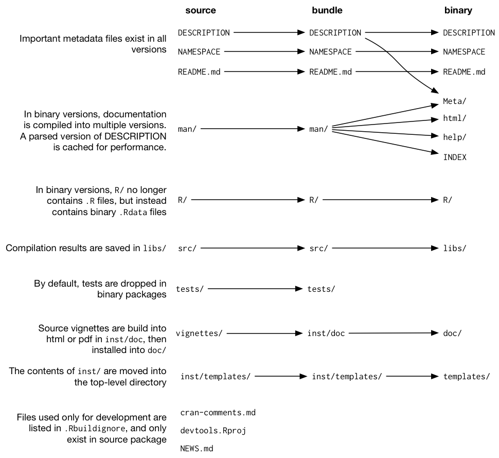
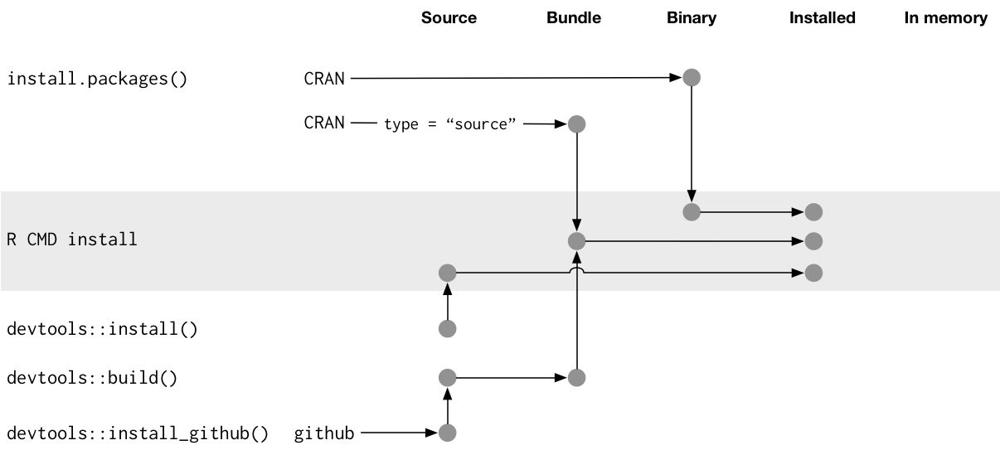

```{r xaringan-themer, include = FALSE}
library(xaringanthemer)
style_mono_accent(
  base_color = "#462B45",
  header_font_google = google_font("Josefin Sans"),
  text_font_google   = google_font("Montserrat", "300", "300i"),
  code_font_google   = google_font("Droid Mono")
)
library(tidyverse)
```


# PREPARE YOUR SYSTEM

1. Update R and RStudio to the latest, released version:  https://www.rstudio.com/products/rstudio/download/

2. Download and load the following packages:

```{r eval = F}
install.packages(c("devtools", "roxygen2", 
                   "testthat", "knitr", 
                   "usethis"))
```

Consider working in the preview version of RStudio as well for latest features (that are more stable than the daily build): https://www.rstudio.com/products/rstudio/download/preview/

---

# DEVTOOLS
  
  - Maintaining a humongous package was inconvenient, so a lot of devtools functionality was split into 7 smaller packages
  - Advice: 
      - when your package depends on devtools, **access functions via one of the smaller 7 packages**
      - Use devtools to install development versions of a package from GitHub or use it to simulate installation and loading: 
  
```{r eval = F}
library(devtools)

load_all() 
 
#or the following if devtools is used inside an R package:

pkgload::load_all()
```

To avoid having to load it every session, consider adding it to your `.Rprofile`:

```{r eval = F}
if (interactive()) {
  suppressMessages(require(devtools))
}
```

---

# BUILDING R PACKAGES FROM SOURCE

- Not necessary to learn for now unless your package uses C or C++ code

- You'll need compiler and command line tools

- Check section 3.3 for instructions specific to your operating system 

---

# PACKAGE STATES

Five states of an R package:
  - `Source`: 
      - a directory of files with a specific structure
  - `Bundled`: 
      - package that’s been compressed into a single file
      - once it's decompressed it looks like source but there are differences 
      - *platform-agnostic* and transportation-friendly
      - made using `devtools::build()` 
  - `Binary`:
      - good for distribution to R users with no package dev tools
      - *platform-specific* (Windows or macOS)
      - **primary maker** and **distributor** of binary packages is CRAN once you submit it to them as a bundle
  - `Installed`: binary package that’s been decompressed into a package library
  - `In-memory`: loaded and ready to use 
  
---

# DIAGRAM PACKAGE STATES

**Note: The book says this diagram has issues and will be remade in the next edition of the book**

```{r echo = F, fig.retina=2.5}

```

---

# CONVERTING BETWEEN PACKAGE STATES



---

# .Rbuildignore

- What is `.Rbuildignore`?
  - each line is a regular expression that matches a path, file or directory to exclude
  - in a bundled package, anything in the .Rbuildignore will not be in the distributed package 

- Two options to add files to `.Rbuildignore`:
  - use correct regular expression, e.g. `^notes$` (*error-prone*)
  - `usethis::use_build_ignore("notes")` (*safest*)

- What to include:
  - Files that help you generate package contents programmatically
  - Files that drive package development, checking, and documentation, outside of CRAN’s purview. 
  
Note: if you want to submit to CRAN, they have requirements and expectations for putting the above in `.Rbuildignore`

