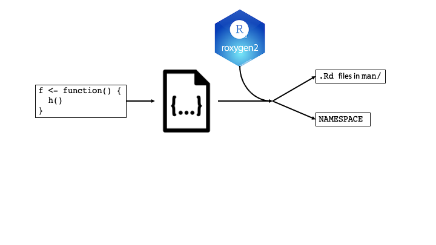
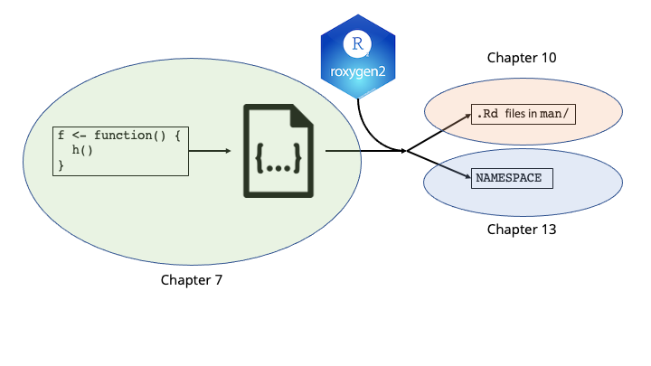
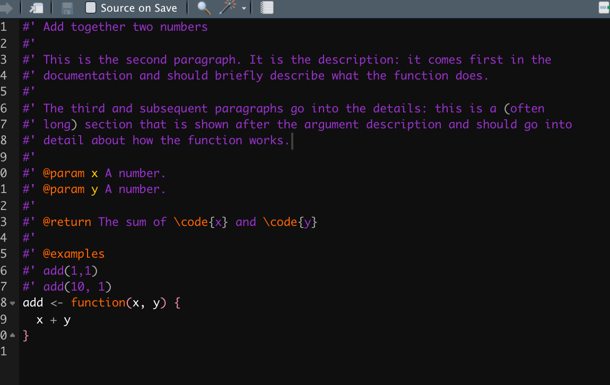
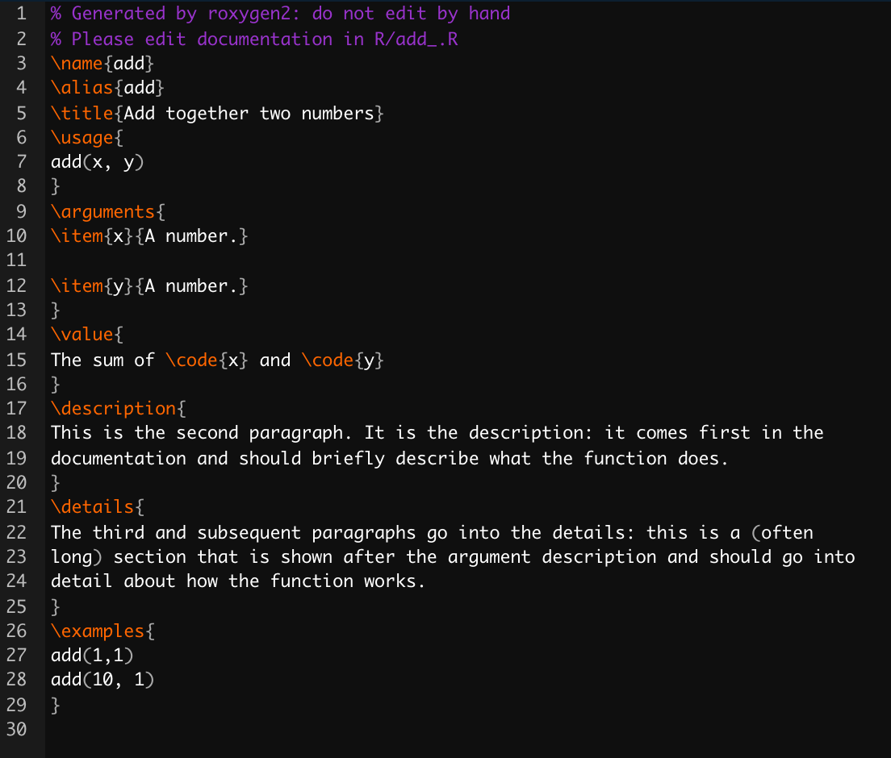
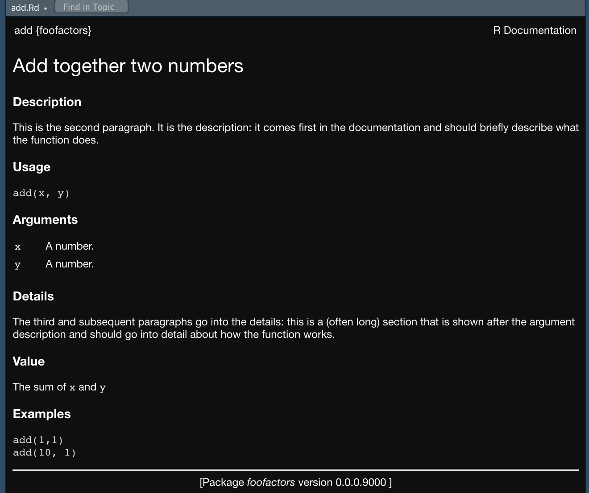
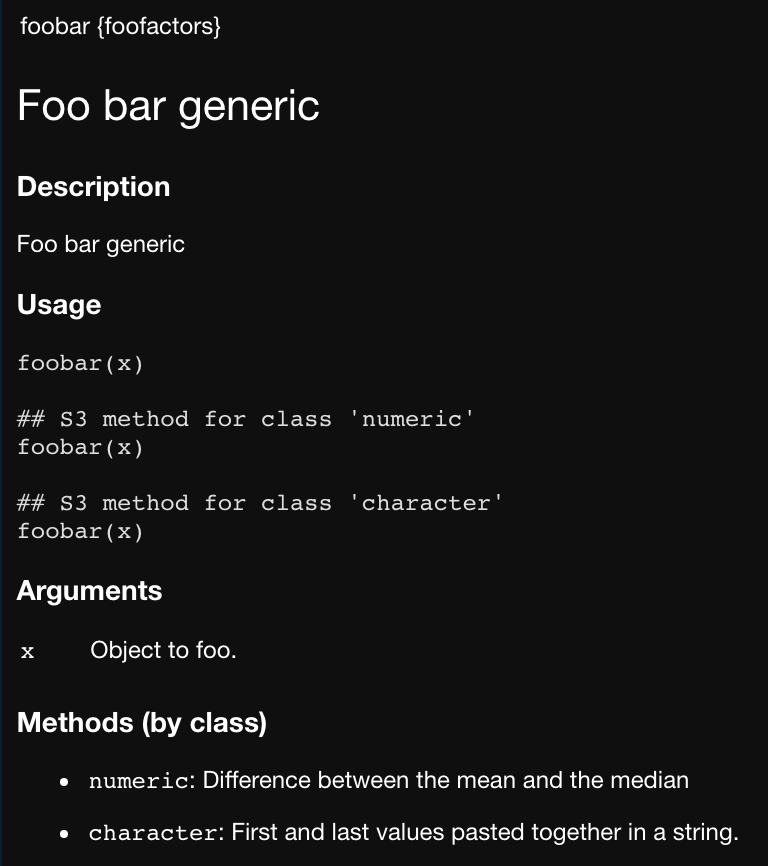

```{r xaringan-themer, include = FALSE}
library(xaringanthemer)
style_mono_light(
  base_color = "#3092FF",
  header_font_google = google_font("Josefin Sans"),
  text_font_google   = google_font("Montserrat", "300", "300i"),
  code_font_google   = google_font("Droid Mono"),
)
```

<style>
.pull-more-left {
  float: left;
  width: 40%;
}
.pull-less-right {
  float: right;
  width: 56%;
}
.pull-less-right ~ * {
  clear: both;
}
.remark-code-line {
  font-size: 0.7em !important;
}
</style>


# The general idea:
.center[

]

---
# The general idea:
.center[

]

---

# Chapter 7: R code
Two important rules:
- Functions go in `.R` scripts in the `R/` directory
- Use these verbs:
  - `load_all()`
  - `test()`
  - `check()`

---
## Organising functions into files
A good rule-of-thumb is that a single `.R` file should contain:
- Multiple, related function definitions and helpers **OR**
- A family of related functions

<br><br>

Make them available with `devtools::load_all()`

---
## Code style
The tidyverse style guide ([https://style.tidyverse.org](https://style.tidyverse.org)) explains "what" and "why"
The styler package ([https://styler.r-lib.org/](https://styler.r-lib.org/)) tells you "how"

```{r}
library(styler)
ugly_code <- "a=function( x){1 + 1}        "
style_text(ugly_code)
```

---
## Execution
+ With scripts, code is executed when it's __run__.

+ In packages, code is executed when it's __built__. 

+ Therefore, package code should only create objects (usually functions).

### Example:
`x <- Sys.time()`
+ if put in a script, `x` reports when the script was `source()`d.
+ if put in a package, `x` reports when the package binary was built.

## Solution: put code into functions

---
### Example: `system.file()`

```{r, eval=FALSE}
dataTableDependency <- list(
  htmlDependency(
    "datatables", "1.10.2",
    c(file = system.file("www/datatables", package = "shinybootstrap2")), #<<
    script = "js/jquery.dataTables.min.js"
  ),
  htmlDependency(
    "datatables-bootstrap", "1.10.2",
    c(file = system.file("www/datatables", package = "shinybootstrap2")), #<<
    stylesheet = c("css/dataTables.bootstrap.css", "css/dataTables.extra.css"),
    script = "js/dataTables.bootstrap.js"
  )
)
```

```{r eval=FALSE}
dataTableDependency <- function() {
  list( #<<
    htmlDependency(
      "datatables", "1.10.2",
      c(file = system.file("www/datatables", package = "shinybootstrap2")),
      script = "js/jquery.dataTables.min.js"
    ),
    htmlDependency(
      "datatables-bootstrap", "1.10.2",
      c(file = system.file("www/datatables", package = "shinybootstrap2")),
      stylesheet = c("css/dataTables.bootstrap.css", "css/dataTables.extra.css"),
      script = "js/dataTables.bootstrap.js"
    )
  )
)
}
```

---
### Example: available colours
```{r eval=FALSE}
show_ansi_colors <- function(colors = num_colors()) {
  if (colors < 8) {
    cat("Colors are not supported")
  } else if (colors < 256) {
    cat(ansi_colors_8, sep = "")
    invisible(ansi_colors_8)
  } else {
    cat(ansi_colors_256, sep = "")
    invisible(ansi_colors_256)
  }
}

ansi_colors_8 <- # code to generate a vector covering basic terminal colors
  
ansi_colors_256 <- # code to generate a vector covering 256 colors
```
Problem: the character vectors `ansi_colors_8` and `ansi_colors_256` were formed and cached when the binary package was built. (Often happens on a headless server, where terminal colours might not be available.)

This solves it:
```{r eval=FALSE}
ansi_colors_8 <- function() {
  # code to generate a vector covering basic terminal colors
}
  
ansi_colors_256 <- function() {
  # code to generate a vector covering 256 colors
}
```

---
### Example: aliasing a function
```{r eval=FALSE}
foo <- pkgB::blah
```

This will cause `foo()` to reflec the definition of `pkgb::blah()` at the version present on the machine where the binary package is built.

This solves it:
```{r eval=FALSE}
foo <- function(...) pkgB::blah(...)
```


---
## The R landscape
+ Other people are going to use your package (maybe) in situations that you might not expect.
+ You must pay attention to the R landscape, including the global settings
+ These are common problems:
  + `library()`, `require()`
      + These modify the search path
  + `options()`
  + `setwd()`
  + `source()`
      + Modifies the current environment
+ If the behaviour of _other_ functions differs before and after running your functions
+ Other functions to avoid:
  + `par()`
  + `Sys.setenv()`
  + `Sys.setlocale()`
  + `set.seed()`


---
### If you __must__ change the R landscape, manage state with `withr`
`on.exit()`-like toolkit
.pull-left[
```{r eval=FALSE}
sloppy <- function(x, sig_digits) {
  options(digits = sig_digits)
  print(x)
}

pi
#> [1] 3.141593

sloppy(pi, 2)
#> [1] 3.1

pi
#> [1] 3.1
```
]

.pull-right[
```{r eval=FALSE}
neat <- function(x, sig_digits) {
  op <- options(digits = sig_digits)
  on.exit(options(op), add = TRUE) #<<
  print(x)
}

pi
#> [1] 3.141593

neat(pi, 2)
#> [1] 3.1

pi
#> [1] 3.141593
```

```{r eval=FALSE}
neater <- function(x, sig_digits) {
  op <- options(digits = sig_digits)
  defer(options(op)) #<<
  print(x)
}

pi
#> [1] 3.141593

neater(pi, 2)
#> [1] 3.1

pi
#> [1] 3.141593
```
]

---
### `withr` comes with some handy helper functions:
```{r echo=FALSE}
d <- tibble::tribble(
              ~`Do/undo.this`,                 ~withr.functions,
              "Set an R option", "local_options(), with_options()",
  "Set an environment variable",  "local_envvar(), with_envvar()",
     "Change working directory",        "local_dir(), with_dir()",
     "Set a graphics parameter",        "local_par(), with_par()"
  )
knitr::kable(d)
```

`with_*()` are best for exectuing a small snipped of code with a modified state

`local_*()` are for modifying state "from now until the function exits"

You can even schedule deferred actions on the global environment. (Useful when experimenting with code that needs to be cleaned up "on exit".)

---
### Isolate side effects

For instance, creating plots or printing output.

Good practice is to isolate them in functions that only produce output.
---
### `.onLoad()` and `.onAttach()`
Use for initial setup when the package loads

For example:
+ To display a message when the package loads
+ To set custom options with `options()`
+ To connect R to another programming language
+ To register vignette engines

If you use `.onLoad()`, you should use `.onUnload()` to clean up any side effects.

---
## Check your package's health
Use `load_all()`, `document()`, `test()` and `check()` liberally (several times an hour, for instance)

It's easier to run these and fix problems "now" than to wait until "later"

---
## CRAN notes
You must use only use ASCII characters in your scripts.

You can inline non-ASCII character data with Unicode (`"\u1234"`) format.

You can find the correct Unicode code point with `stringi::stri_escape_unicode()`:
```{r}
x <- "This is a bullet •"
cat(stringi::stri_escape_unicode(x))
```

The functions `tools::showNonASCII()` and `tools::showNonASCIIfile(file)` can help you find non-ASCII characters in your R code. 

---
# Chapter 10 Object documentation
.center[

]

---
# Chapter 10 Object documentation

Documentation occurs via `.Rd` files in the `man/` directory

Use roxygen2 to create `.Rd` files

Roxygen2 can also manage `NAMESPACE` file and `Collate` field in `DESCRIPTION` file
---
## Four steps to documentation:
1. Add roxygen comments to your `.R` file.
1. Run `devtools::document()` to convert roxygen comments to `.Rd` files.
    + (or press Ctrl/Cmd + Shift + D in RStudio)
1. Preview documentation with `?`.
1. Rinse and repeat.

### However:
Preview documentation pages created with `devtools::document()` will not show links between pages. 

If you need this, you must build and reload (Ctrl/Cmd + Shift + B).

---
## Roxygen comments
.pull-left[

]
.pull-right[

]

---
## Roxygen comments
.pull-left[

]
.pull-right[

]

---
## Roxygen comments - functions
.pull-left[
Just saw:
+ `@param name description`
  + Describes the function's inputs
+ `@return description`
  + Describes the output
+ `@examples`
  + Provides executable R code showing how to use the function
  + Can include a `dontrun{}` to include code that causes an error
+ `@example path/relative/to/package/root`
  + To use examples in a separate file
]

.pull-right[
Other important ones:
+ `@export`
  + makes function available to a user after attaching package
+ `@seealso`
  + Allows you to point to other resources
+ `@family`
  + To link to every other related function in a "family"
  + Aliases and topics can be accessed with `?`
+ `@aliases`
  + adds additional aliases to the "topic"
+ `@keywords`
  + Must be taken from a predifined list 
]

---
## Roxygen comments - datasets

+ Coming to a book club near you! (Week 10)

---
## Roxyngen comments - packages

Can provide a help page for your package as a whole.

This is a supplement to the vignettes.

Document `NULL` and label with `@docType package` and `@name <package-name>`

```{r eval=FALSE}
#' foo: A package for computating the notorious bar statistic
#'
#' The foo package provides three categories of important functions:
#' foo, bar and baz.
#' 
#' @section Foo functions:
#' The foo functions ...
#'
#' @docType package
#' @name foo
NULL
#> NULL
```

---
## Documenting classes, generics and methods

### S3
S3 **generics** are regular functions and should be documented as such

S3 **classes** have no formal definition, so document the constructor function 

S3 **methods** should be documented in the more complicated cases (or if it includes additional arguments)


---
### S4
S4 **generics** are functions and should be documented as such

S4 **classes** are documented by adding a roxygen block before `setClass()`
+ Use `@slot` to document the slots of the class a la `@param` above:
```{r eval=FALSE}
#' An S4 class to represent a bank account.
#'
#' @slot balance A length-one numeric vector
Account <- setClass("Account",
  slots = list(balance = "numeric")
)
```

S4 **methods** are complicated:
+ All S4 methods must be documented in one of three ways:
  1. In the class
  1. In the generic
  1. In its own file


---
### RC
Has a special convention for documenting **methods**: the **docstring**.

Docstrings are included in the "Methods" section of the **class** documentation.


---
## Special characters
+ `"@"` is inserted with `@@`.

+ `%` is escaped with `\%`. (Not needed in examples).

+ `\` is inserted with `\\`.

---
## Creating self-contained documentation
### Inheriting parameters
+ `@inheritParams source_function` to bring in documentation from other functions.
+ Can be in current package (`@inheritParams function`) or another package (`@inheritParams package::function`)

.pull-left[
```{r eval=FALSE}
#' @param a This is the first argument
foo <- function(a) a + 10

#' @param b This is the second argument
#' @inheritParams foo
bar <- function(a, b) {
  foo(a) * 10
}
```
]

.pull-right[
```{r eval=FALSE}
#' @param a This is the first argument
#' @param b This is the second argument
bar <- function(a, b) {
  foo(a) * 10
}
```

]

---
### Documenting multiple functions in the same file
Use when functions have very similar arguments or have complementary effects.
#### `@describeIn`
+ For the most common cases:
  + Documenting methods in generics
  + Documenting methods in a class
  + Documenting functions with similar arguments
  
---
  
```{r eval=FALSE}
#' Foo bar generic
#'
#' @param x Object to foo.
foobar <- function(x) UseMethod("foobar")

#' @describeIn foobar Difference between the mean and the median
foobar.numeric <- function(x) abs(mean(x) - median(x))

#' @describeIn foobar First and last values pasted together in a string.
foobar.character <- function(x) paste0(x[1], "-", x[length(x)])
```

.center[
```{r echo=FALSE, out.width="50%"}

```
]
---
#### `@rdname`
Allows you to merge documentation for multiple objects into one file

See more about this next week?

---
# Namespace
.center[

]

---
# Namespace
A space for names

Tells R where to find the value associated with a name:

.center[`Hmisc::summarize()` v. `plyr::summarize()`]

Make your package self-contained in two ways:
1. Imports
  + Defines how a function in one package finds a function in another
1. Exports
  + Specifies which functions are available outside your package

---
## Search path
The list of all packages that are **attached**.

Access with `search()`

.pull-left[
### Loading
+ Loads the package into memory
+ Package **is not** in the search path
+ Access components with `::`
+ Rarely done explicitly, but often used in packages
+ Found under `Imports` in `DESCRIPTION` file.
]

.pull-right[
### Attaching
+ Puts the package in the search path
+ Accomplished with `library()` or `require()`
+ Also loads the package
+ Accessed with `search()`
+ Found under `Depends` in `DESCRIPTION` file.
]

---
## The `NAMESPACE` file
Each line contains a **directive**.

Each directive describes an R object (4 for exports, 4 for imports).

Use Roxygen2 to generate the `NAMESPACE` file just like for function documentation:
1. Add roxygen comments to your .R files.
1. Run `devtools::document()` to convert to `.Rd` files.
1. Check that specification is correct in `NAMESPACE`.
1. Rinse and repeat.


---
## Exports
Good practice is to only export functions that others will use.

Create with `@export` in the roxygen block.

For S3, S4 or RC, you should export different things. 

.center[## To be discussed next week!]

---
## Imports
`NAMESPACE` controls which external functions can be used by your package without having to use `::`.

Confusion: `Imports` field of the `DESCRIPTION` file versus import directive of `NAMESPACE` file. 
+ Authors' advice: list packages in `DESCRIPTION` (so it's installed) and refer to it explicitly with `pkg::fun()`.
+ R functions can be imported explicitly in `DESCRIPTION` with `@importFrom pkg fun`.
+ Works with operators as well: `@importFrom magrittr %>%`

S3 generics imported like regular functions. Methods will come along.

S4 is more complicated. 

---

---

---

---

---

---

---


class: inverse, hide-logo

# Another Slide
This slide doesn't have a logo
